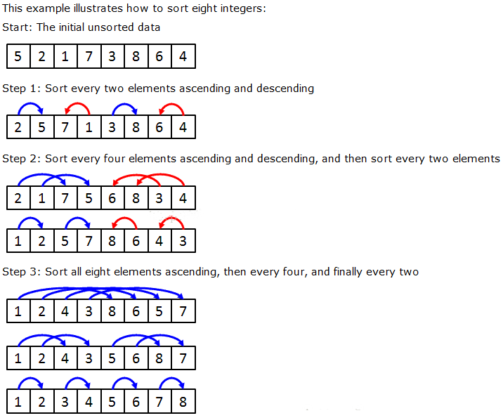
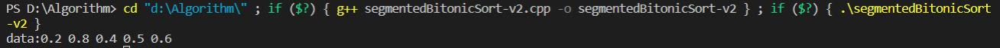
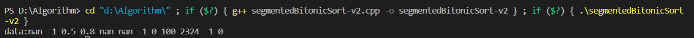

# 分段双调排序

## 基本概念

### 双调序列定义

双调序列是指由一个非严格增序列 $X$ 和非严格减序列 $Y$ 构成的序列（$X$ 和 $Y$ 的位置可互换），比如序列（23,10,8,3,5,7,11,78）。

定义：一个序列 $a_1,a_2,...,a_n$ 是双调序列，如果：

1. 存在一个$a_k(1\leqslant k\leqslant n)$ 使得 $a_1\geqslant...\geqslant a_k\leqslant...\leqslant a_n$成立（或者$a_1\leqslant...\leqslant a_k\geqslant...\geqslant a_n$成立）
2. 序列能够循环移位满足条件1

### Batcher定理

将任意一个长为 $2n$ 的双调序列 $A$ 分为**等长**的两半 $X$ 和 $Y$，将 $X$ 中的元素与 $Y$ 中的元素一一按原序比较，即 $a[i]$ 与 $a[i+n] (i < n)$ 比较，将较大者放入 $MAX$ 序列，较小者放入 $MIN$ 序列。则得到的 $MAX$ 和 $MIN$ 序列仍然是双调序列，并且 $MAX$ 序列中的任意一个元素不小于 $MIN$ 序列中的任意一个元素。

伪代码为：

```c++
for (i=0;i<n;i++) {
    if (get(i)>get(i+n)) exchange(i,i+n);
}
```

### 双调合并

假设有一个双调序列，则根据 Batcher 定理，将该序列划分成2个双调序列，然后继续对每个双调序列递归划分，得到更短的双调序列，直到得到的子序列长度为1为止。这时的输出序列按单调递增顺序排列。

以最终生成一个升序序列为例。把一个序列 $(1…n)$ 对半分，假设 $n=2^k$，然后 $1$ 和 $\frac{n}{2}+1$ 比较，小的放上；接下来 $2$ 和 $\frac{n}{2}+2$ 比较，小的放上，以此类推；然后看成两个 $\frac{n}{2}$ 长度的序列，因为他们都是双调序列，所以可以重复上面的过程；总共重复 $k$ 轮，即最后一轮已经是长度是2的序列比较了，就可得到最终的排序结果。

整个过程所需要的划分次数为 $logn$。这个应用双调划分来**对双调序列进行排序**的过程称为Bitonic merge（双调合并）。


### 双调排序

上述所说的是用双调合并对一个双调序列进行排序，但是给我们的数组可能并不是双调的，这样也就用不了双调合并。该如何把一个乱序序列转换成双调序列呢？

将两个相邻的，单调性相反的单调序列看作一个双调序列， 每次将这两个相邻的，单调性相反的单调序列排序生成一个新的双调序列， 然后利用上述双调合并生成单增或者单减的序列。 这样只要每次两个相邻长度为 $n$ 的序列的单调性相反， 就可以通过连接得到一个长度为 $2n$ 的双调序列，然后对这个 $2n$ 的序列进行一次双调合并变成有序，然后再把两个相邻的 $2n$ 序列合并（在排序的时候第一个升序，第二个降序）。 $n$ 开始为1， 每次翻倍，直到等于数组长度， 最后进行一次双调合并即可。

下图很好的展示了这个过程：


### 问题

上述的双调合并和双调排序算法只能应付长度为 $2^k$ 的数组。如何转化为能针对任意长度的数组呢？可以考虑填充，即使用一个定义的最大或者最小者来填充数组，让数组的大小填充到 $2^k$ 长度，再进行排序。最后过滤掉那些最大（最小）值即可。这种方式会使用到额外的空间，而且有时候需要填充的空间比较大。但是这种方法比较容易转化为针对GPU的并行算法。所以一般来说，并行计算中常使用双调排序来对一些较小的数组进行排序。 

## 双调算法设计思路

参考代码来自Thomas W. Christopher对于[Bitonic Sort](http://www.tools-of-computing.com/tc/CS/Sorts/bitonic_sort.htm)的研究

### 递归版本伪代码

首先使用`sortup`, `sortdown`函数来排序出不递减序列或者不递增序列，最终通过`mergeup`, `mergedown`递归合并成有序序列。`void sortup(int m, int n)`将 $[m,m+n)$ 区间内的 $n$ 个元素按不递减顺序排列，然后使用`void mergeup(int m, int n)`将该区间的 $n$个元素归并到整个不递减序列中。其余两个函数功能类似。

```c++
void sortup(int m, int n) {//from m to m+n
    if (n==1) return;
    sortup(m,n/2);					//将[m,m+n/2) 区间内的n/2个元素按不递减顺序排列
    sortdown(m+n/2,n/2);			//将[m+n/2,n) 区间内的n/2个元素按不递增顺序排列
    mergeup(m,n/2);					//上述将序列处理成了单增单减双调序列，再用双调合并生成单增序列
}
void sortdown(int m, int n) {//from m to m+n
    if (n==1) return;
    sortup(m,n/2);
    sortdown(m+n/2,n/2);
    mergedown(m,n/2);
}
void mergeup(int m, int n) {
    if (n==0) return;
    int i;
    for (i=0;i<n;i++) {
        if (get(m+i)>get(m+i+n)) exchange(m+i,m+i+n);
    }
    mergeup(m,n/2);					//对[m,m+n/2) 区间内的n/2个元素进行双调归并
    mergeup(m+n,n/2);				//对[m+n/2,n) 区间内的n/2个元素进行双调归并
}
void mergedown(int m, int n) {
    if (n==0) return;
    int i;
    for (i=0;i<n;i++) {
        if (get(m+i)<get(m+i+n)) exchange(m+i,m+i+n);
    }
    mergedown(m,n/2);
    mergedown(m+n,n/2);
}
```

### 非递归版本伪代码

```c++
int i,j,k;
for (k=2;k<=N;k=2*k) {					//k控制待排序区间的长度（从2开始递增）
  for (j=k>>1;j>0;j=j>>1) {				//j用于将当前区间拆分成两个相邻的子区间（长度为j和k-j）
    for (i=0;i<N;i++) {					//i循环遍历当前待排序区间中的所有元素
      int ixj=i^j;						//找到与i相差j个的元素
      if ((ixj)>i) {
        //应该要递增的子序列，小的元素放在前头
        if ((i&k)==0 && get(i)>get(ixj)) exchange(i,ixj);
        //应该要递减的子序列，大的元素放在前头
        if ((i&k)!=0 && get(i)<get(ixj)) exchange(i,ixj);
      }
    }
  }
}
```

下图很好的展示了这个过程。我们先从 $k=2$ 开始考虑，即待排区间的长度为2，$j=1$表示将长度为2的区间分成了两个长度为1的区间，之后从第一个元素 $i=0$ 开始考虑，通过**异或**算得与它相差 $j$ 个单位的元素（即要和它比较的元素），通过**与运算**的到该子序列应该是单增还是单减，具体来说，如果 $i$ 和 $ixj$ 在同一组中，那么它们在当前比较交换的轮次中，**它们的二进制表示在第 $k$ 位上必定相同**，即满足 $p\&k=0$；否则，它们在不同的组中，**此时二进制表示在第 $k$ 位上必定不同**，即满足 $p\&k!=0$。更通俗的来说，其实就是**第奇数个长度为 $k$ 的序列必须是单增，第偶数个长度为 $k$ 的序列必须是单单减**。之后 $k=4,j=2$，再从  $i=0$ 考虑与它相差 $j$ 个单位的元素，排完序后，$j=1$ 以此类推。最后当 $k=8$ 时，为数组长度了，此时序列为双调序列，只需要利用双调归并将其变成升序序列即可。



算法设计思路至此结束。题目要求我们对每个段使用双调排序，那我们只需将每一个段补充为长度为 $2^k$ 的序列，再分别对每个段使用上述算法，最后将整个`data`数组输出即可。

## 尝试过和完成了的加分挑战

递归的版本为`segmentedBitonicSort-v1.cpp`，该程序使用了递归，调用了函数，在 line74 使用了`new`，使用了全局变量 `arr`，也没有对特殊数据 `NaN` 进行处理。

故在非递归版本`segmentedBitonicSort-v2.cpp`做出改变。

- 不递归：`segmentedBitonicSort`函数及其所调用的任何其他函数都不得直接或间接地进行递归。

​		【$\surd$】`segmentedBitonicSort-v2.cpp`没有使用递归。

- 不调用函数：`segmentedBitonicSort`不调用除标准库函数外的任何其他函数。

​		【$\surd$】`segmentedBitonicSort-v2.cpp`没有调用除标准库函数外的任何其他函数。

- 内存高效：`segmentedBitonicSort`及其所调用的任何其他函数都不得进行动态内存分配，包括`malloc`、`new`和静态定义的`STL`容器。

​		【$\surd$】`segmentedBitonicSort-v2.cpp`不再使用`new`，而是使用静态分配内存，定义一个`float`类型数组，大小硬编码为10010。					本来想使用`vector`进行数据存储，这样可以随时扩展数组大小，保证内存足够且不浪费，但是要求不能使用静态定义的`STL`					容器，遂放弃。

- 可并行：`segmentedBitonicSort`涉及到的所有时间复杂度`O(n)`以上的代码都写在`for`循环中，而且每个这样的`for`循环内部的循环顺序可以任意改变，不影响程序结果。注：自己测试时可以用`rand()`决定循环顺序。

​		【$\times$】没太看明白这个挑战的意思。

- 不需内存：`segmentedBitonicSort`不调用任何函数（包括C/C++标准库函数）， 不使用全局变量，所有局部变量都是`int`、`float`或指针类 型，C++程序不使用`new`关键字。

​		【$\surd$】同挑战3一同完成。

- 绝对鲁棒：在输入数据中包含`NaN`时（例如 $sqrt(-1.f)$），保证除`NaN`以外的数据正确排序，`NaN`的个数保持不变。

​		【$\surd$】利用`var != var`判定是否是`NaN`，若是`NaN`则**在比较的时候当作较小数**。

## 可以独立运行的源代码

编写IDE：`vscode`

递归版本：`segmentedBitonicSort-v1.cpp`

非递归版本：`segmentedBitonicSort-v2.cpp`

## 测试数据

使用非递归版本对数据进行测试

测试样例一：该测试样例为没有`NaN`的正常情况

```c++
float data[5] = {0.8, 0.2, 0.4, 0.6, 0.5};
int seg_id[5] = {0, 0, 1, 1, 1};
int seg_start[3] = {0, 2, 5};
int n = 5, m = 2;
```



测试样例二：该测试样例来自[参考文献](https://blog.csdn.net/u014226072/article/details/56840243)，含有`NaN`的情况

```c++
float data[12] = {0.8, -1, sqrt(-1.f), 0.5, 100, 2324, -1, sqrt(-1.f), sqrt(-1.f), 0, -1, 0};
int seg_id[12] = {0, 0, 0, 0, 1, 1, 1, 1, 1, 1, 2, 2};
int seg_start[4] = {0, 4, 10, 12};
int n = 12, m = 3;
```

`NaN`会作为最小值放在每一段的开头。



## 性能分析

算法主要集中在三重循环那。对于 $n$ 长度的数据，总共需要考虑 $log_2n$ 次 $k$ 的取值，而 $j$ 的取值同样需要考虑  $log_2n$ 次，最后需要对每一个下标为 $i(0\leqslant i \leqslant n)$ 的数据考虑。故算法的时间复杂度为 $O(n(logn)^2)$。

## 测试的起始和完成时间以及实际使用的时间

测试起始时间：2023.4.30下午1点

完成时间：2023.5.1下午4点

实际使用时间：总共实际使用时间大概9小时。首先是查阅相关资料和理解算法原理花费大约3小时，递归版本的编写花费大约1小时，非递归版本的理解和编写大约花费2小时，最后用了3小时来编写文档。

## 参考资料

[三十分钟理解：双调排序Bitonic Sort，适合并行计算的排序算法](https://blog.csdn.net/xbinworld/article/details/76408595)

[Bitonic Sort（双调排序）基础](https://blog.csdn.net/jiange_zh/article/details/49533477)

[Bitonic Sort](http://www.tools-of-computing.com/tc/CS/Sorts/bitonic_sort.htm)

[分段双调排序实现](https://blog.csdn.net/u014226072/article/details/56840243)